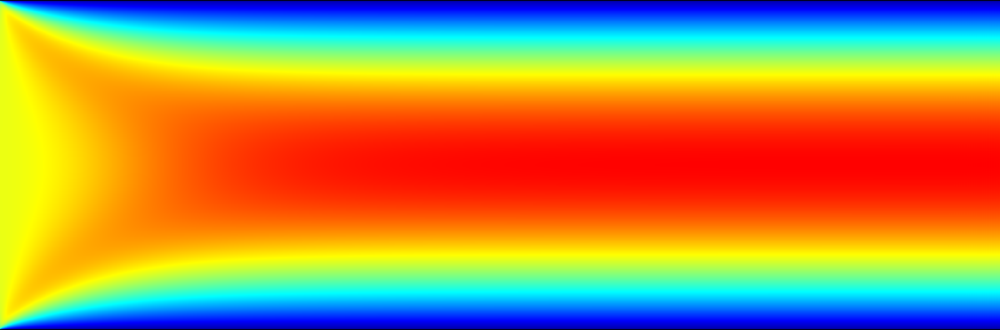
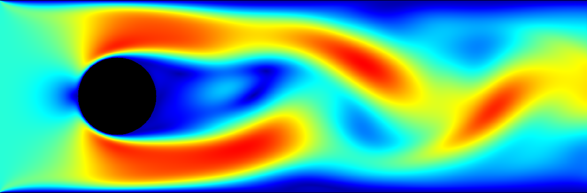
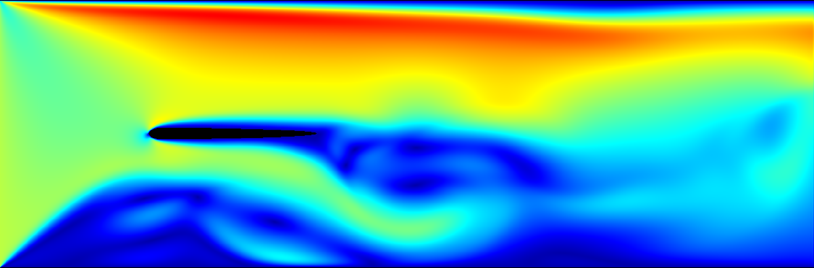
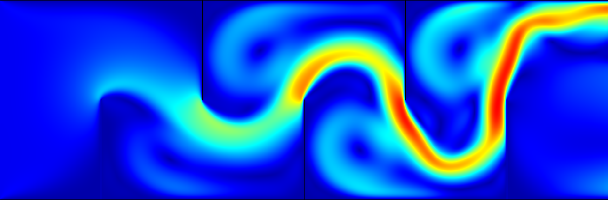
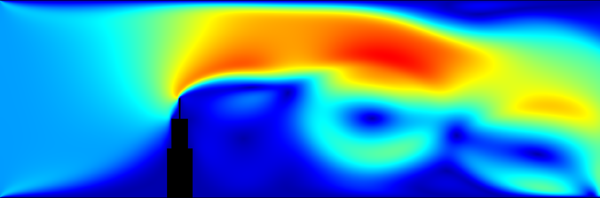
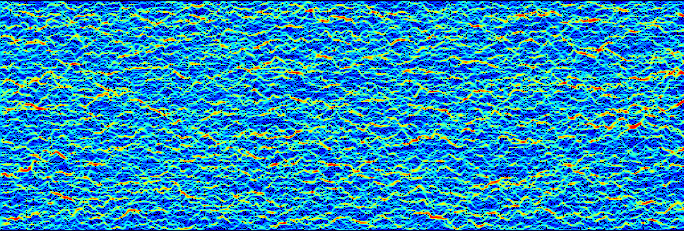

# PortLBM: Portable GPU-accelerated Lattice Boltzmann Method Simulations

PortLBM is a GPU-accelerated 2D fluid simulator based on the Lattice Boltzmann Method (D2Q9 lattice, BGK collision operator). It implements four LBM algorithms across three data layouts, and targets AMD, NVIDIA, and Intel GPUs through a single SYCL codebase. An optional ImGui/ImPlot interface enables real-time visualization and interactive parameter control.

## Example Scenarios

| | | |
|:---:|:---:|:---:|
|  |  |  |
| `Hagen-Poiseuille` | `circle` | `wing` |
|  |  |  |
| `walls` | `skyscraper` | `porous` |

## Getting started

### Dependencies

Only two dependencies must be installed manually. Everything else is either auto-fetched by CMake or installed via the provided script.

| Software | Version | Manual install | Spack command |
| -------- | ------- | :------------: | -------------- |
| [llvm](https://github.com/llvm/llvm-project) | 18.1.8 | yes | `spack install llvm@18.1.8 +llvm_dylib -gold +clang` |
| [boost](https://www.boost.org) | 1.85.0 | yes | `spack install boost@1.85.0 +fiber +context +atomic +filesystem` |
| [AdaptiveCpp](https://github.com/AdaptiveCpp/AdaptiveCpp) | v24.10 | no | — |
| [glfw](https://github.com/glfw/glfw) | 3.3.8 | no | `spack install glfw@3.3.8` |

> **Note:** Building LLVM with Spack can take more than one hour depending on your machine.

AdaptiveCpp is installed automatically by the provided `install_adaptivecpp.sh` script (see below). GLFW is auto-fetched by CMake if not found on the system, but requires X11 dev headers (`sudo apt install libxrandr-dev libxinerama-dev libxcursor-dev libxi-dev`); alternatively install via Spack. [nlohmann/json](https://github.com/nlohmann/json) and [fmt](https://github.com/fmtlib/fmt) are also fetched automatically by CMake.

### Installing AdaptiveCpp

AdaptiveCpp is installed via the provided script, which clones the source and builds it into the build directory:

```bash
# NVIDIA GPU (default)
./install_adaptivecpp.sh

# AMD GPU
./install_adaptivecpp.sh --rocm

# CPU / OpenMP only (no GPU required)
./install_adaptivecpp.sh --cpu

# Custom build directory (default: ./build)
./install_adaptivecpp.sh --build-dir /path/to/build
```

CMake automatically picks up the installation from the build directory — no additional flags needed.

### Building

```bash
# Without GUI
cmake -B build -DCMAKE_CXX_COMPILER=clang++ -DCMAKE_BUILD_TYPE=Release -DWITH_NAN_PROTECTION=OFF
cmake --build build

# With GUI
cmake -B build -DCMAKE_CXX_COMPILER=clang++ -DCMAKE_BUILD_TYPE=Release -DWITH_VISUALIZATION=ON -DWITH_NAN_PROTECTION=ON
cmake --build build
```

### Running

The executable locates `settings/settings.json` relative to itself, so it can be invoked from any working directory:

```bash
./build/portlbm                        # from the project root
/absolute/path/to/build/portlbm        # absolute path

# Use a custom settings file
./portlbm /path/to/settings.json
```

### Running the tests

```bash
cmake -B build -DCMAKE_CXX_COMPILER=clang++ -DFORCE_USE_CPU=ON -DPORTLBM_BUILD_TESTS=ON
cmake --build build
ctest --test-dir build --output-on-failure
```

## Compile options

| Option | Default | Explanation |
| ------ | ------- | ----------- |
| `-DWITH_VISUALIZATION` | `OFF` | Build with the ImGui/ImPlot GUI. |
| `-DWITH_NAN_PROTECTION` | `ON` | Zero out NaN/Inf density and velocity values at each step. |
| `-DUSE_FLOAT` | `OFF` | Use `float` instead of `double` as `real_type`. Changes the ABI — all targets must agree. |
| `-DFORCE_USE_CPU` | `OFF` | Use the CPU even when a faster device is available. |
| `-DBENCHMARK_MODE` | `OFF` | Enable the benchmark driver (requires `PORTLBM_BUILD_EXECUTABLE=ON`). |
| `-DPORTLBM_BUILD_EXECUTABLE` | `ON` | Build the `portlbm` driver executable. |
| `-DPORTLBM_BUILD_TESTS` | `OFF` | Build the Catch2 unit and integration tests. |

## Simulation settings

Settings for the `portlbm` executable are read from `settings/settings.json`. A complete file looks like this:

```json
{
    "algorithmic": {
        "algorithm": "nptl",
        "dataLayout": "stream",
        "debugMode": false,
        "frameUpdateInterval": 1,
        "timeSteps": 100000,
        "workGroupSize": 1024
    },
    "domain": {
        "horizontalNodes": 2000,
        "scenario": "Hagen-Poiseuille",
        "verticalNodes": 500
    },
    "physical": {
        "inletDensity": 1.2,
        "inletVelocity": { "x": 0.0, "y": 0.0 },
        "outletDensity": 1.0,
        "outletVelocity": { "x": 0.0, "y": 0.0 },
        "relaxationTime": 0.6
    }
}
```

Setting `debugMode` to `true` enables verbose per-iteration console output and, when the GUI is active, prints density and velocity values directly into the plots. This is only practical for very small domains (roughly 10×10 nodes with a work-group size of 16). It must be `false` when running benchmarks.

All other parameters can also be adjusted from the GUI at runtime.

### Parameter `"algorithm"`

| Value | Description |
| ----- | ----------- |
| `nptl` | Non-linear Pull Two-Lattice — two-lattice with 2-D indexation; custom work decomposition. |
| `lptl` | Linear Pull Two-Lattice — two-lattice with 1-D indexation; work decomposition by the SYCL runtime. |
| `npol` | Non-linear Pull One-Lattice — space-efficient two-lattice using buffers; no second lattice permanently resident. |
| `nsol` | Non-linear Swap One-Lattice — swap algorithm with 2-D indexation and `local` memory buffering. Requires work-group size ≥ 6. |

### Parameter `"dataLayout"`

All three layouts were proposed by [Mattila et al.](https://doi.org/10.1016/j.camwa.2007.08.001):

| Value | Description |
| ----- | ----------- |
| `stream` | Stores each distribution function contiguously across all nodes (Structure of Arrays). Optimises the streaming step: neighbours of the same direction are adjacent in memory. |
| `collision` | Stores all nine distribution functions for each node contiguously (Array of Structures). Optimises the collision step: all values needed for a single node update are co-located. |
| `bundle` | Interleaves pairs of opposite directions node by node. Reduces the working set during fused streaming–collision and can improve cache utilisation on some hardware. |

### Parameter `"frameUpdateInterval"`

Every `frameUpdateInterval` steps the macroscopic observables (density, velocity) are copied to the CPU. A value larger than `timeSteps` means the copy happens only once at the very end of the run, which avoids PCIe transfer overhead during long simulations.

### Parameter `"timeSteps"`

Total number of LBM iterations. Any value from `1` to `UINT_MAX` is accepted.

### Parameter `"workGroupSize"`

SYCL work-group size. For all algorithms except `nsol`, any value from `1` up to the device maximum (`sycl::info::device::max_work_group_size`) is valid. `nsol` requires a minimum of `6`.

### Parameter `"scenario"`

| Value | Description |
| ----- | ----------- |
| `Hagen-Poiseuille` | Pipe flow with no inner obstacles. |
| `walls` | Pipe flow with a labyrinth-like wall arrangement. |
| `circle` | Pipe flow with a circular obstacle near the inlet. |
| `square` | Pipe flow with a square obstacle near the inlet. |
| `wing` | Pipe flow around a wing profile. |
| `skyscraper` | Pipe flow around a three-story skyscraper (upper stories are taller and narrower). |
| `porous` | Flow through a randomised porous medium bounded at top and bottom. |
| `plate` | Pipe flow with a plate obstacle near the inlet. |

### Parameter `"relaxationTime"`

Controls fluid viscosity (ν = c²ₛ(τ − ½)). Any positive value is accepted, but the simulation is rarely stable below `0.6`.

### Parameters `"horizontalNodes"` and `"verticalNodes"`

Inner domain extents (ghost nodes are added automatically). The minimum inner extent in each direction is `1`; the maximum is whatever keeps the total node count below `UINT_MAX`.

### Parameters `"inletDensity"` and `"outletDensity"`

Inlet and outlet densities, which drive the pressure gradient. Must be strictly positive. At equilibrium without flow the fluid density is `1.0`.

### Parameters `"inletVelocity"` and `"outletVelocity"`

Velocity boundary conditions with `x` and `y` components. Velocities near the lattice speed of sound (|u| ≈ 1/√3) typically destabilize the simulation. The outlet velocity has no effect when the default [Zou–He](https://doi.org/10.1063/1.869307) density boundary condition is active.

## How To Cite

```
@misc{PortLBM2026,
  author = {Strack, Alexander and Graf, Marcel and Van Craen, Alexander and Pfl{\"u}ger, Dirk},
  title  = {{PortLBM}: A Portable Lattice {Boltzmann} Tool Leveraging {SYCL} on {AMD}, {NVIDIA}, and {Intel GPUs}},
  year   = {2026},
  note   = {To appear in Euro-Par 2026: Parallel Processing Workshops}
}
